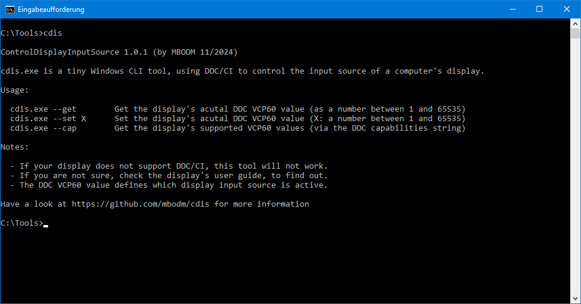

# cdis

A tiny Windows command line tool to change a display's input source by using DDC/CI

### What is it?

- It's a tiny command line tool for Windows 10/11
- It's named `cdis.exe` where "cdis" stands for "**C**ontrol**D**isplay**I**nput**S**ource"
- It uses the DDC/CI standard to control the input source of a DDC-capable display/monitor
- It does this by using the Windows API
- It runs on any 64-bit Windows 10/11 machine
- Its release binary/executable has a size of ~2MB
- It's a .NET 8 console application and it's written in C#
- It's developed with Visual Studio 2022 17.12.1 (Community Edition)
- It has no dependencies to anything (no 3rd party library, etc.)
- It's built by using the global `dotnet` tools on the command line
- It's built on a Windows 11 machine (Windows 11 version 23H2 build 22631.4460)
- It's built and published as a _self-contained_ .NET 8 assembly/executable
- It's built and published using _win64_ as target platform
- It's built and published with AOT active (in ".csproj") to shrink executable size to 2MB (from 13MB)
- It doesn't require any runtime-installation (since _self-contained_ apps run stand-alone)
- It's the result of my early [ControlDisplayInputSource](https://github.com/MBODM/ControlDisplayInputSource) experiments
- It's the direct successor of my later [cdis2410](https://github.com/MBODM/cdis2410) and [cdis2410-net48](https://github.com/MBODM/cdis2410-net48) tools
- It's free to use and open source (under MIT license)

### Why it exists?

It's possible to change the input source of a computer's display/monitor by software (in contrast to the hardware buttons of your display). Typically by using DDC/CI commands. The DDC VCP60 command is the key component here.

I was just looking for a simple way to quickly switch my display's input source between 3 computers, with just one click. I found some tools out there (which all use DDC/CI too, of course). But i decided to build a simple and tiny tool by myself, which i can use in scripts or Windows Desktop shortcuts.

As a result, this tool was born.

### How to use?

The tool itself should be rather self-explanatory. Just use the `--cap` argument to see which VCP60 values your display supports. Each VCP60 value represents one physical input source of your display. Either you just test each VCP60 value (by using the `--set` argument), or you take a look into your display's user manual, to find out which VCP60 value corresponds to which physical input source. By using the `--get` argument you can see which VCP60 value (and therefore the corresponding input source) is currently active.

### Fine, anything else?

##### 1)
A suggestion or "_How to switch the input source, by using the keyboard?_" (this is how i personally use the tool):

Since `cdis.exe` is a CLI tool, you can use it in scripts or shortcuts. Personally, i created 2 different `cdis.exe --set [NUMBER]` Windows Desktop shortcuts (".lnk" files). One for each of my other 2 computers. For each Windows Desktop shortcut i defined a keyboard hotkey (right-click and select "Properties"). In example something like "SHIFT+ALT+RIGHTARROW". This way you just need to press those keys on your keyboard, to quickly switch to another computer. Hint: You can also pin Windows Desktop shortcuts to "Start" or the Windows TaskBar.

The only downside of this "trick" is: Sometimes Windows adds a small delay (1-2 seconds), when using the keyboard hotkey. You can read this [superuser blogpost](https://superuser.com/questions/426947/slow-windows-desktop-keyboard-shortcuts) to see why and which solutions exist.

##### 2)
The tool also runs on any other (older) Windows platform (like Windows 7 or Windows 8). You just need to install a .NET 8 runtime on those platforms. Then download the above source and publish it as _framework-dependent_. I just don't provide this out of the box, as binary in the [Releases](https://github.com/mbodm/cdis/releases) section, since there are not that many people out there, using such old Windows versions.

If in doubt, just use your GoogleFu when it comes down to "_the modern .NET platform_", "_self-contained & framework-dependent_", `dotnet build` and such things. It's really simple.

#### Have fun.
