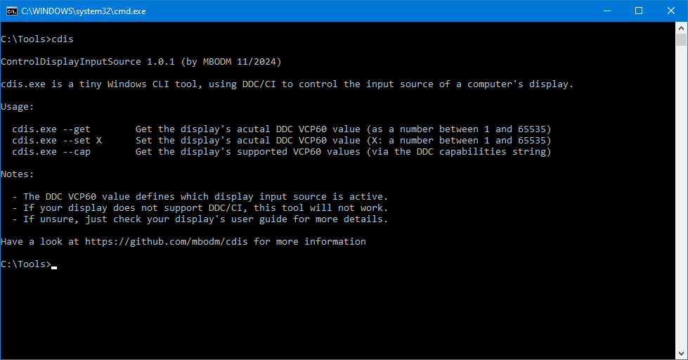

# cdis

A tiny Windows command line tool to change a display's input source by using DDC/CI

### What is it?

- It's a tiny command line tool for Windows 10/11
- It's named `cdis.exe` where "cdis" stands for "**C**ontrol**D**isplay**I**nput**S**ource"
- It uses DDC/CI to control the input source of a DDC-capable display/monitor
- It does this by using the Windows API
- It runs on any Windows 10/11 machine
- Its release binary (executable) has a size of ~12KB
- It's a .NET Framework 4.8 console application and it's written in C#
- It has no dependencies to anything (no 3rd party library, etc.)
- It's developed by using the more modern SDK-style project format in ".csproj" file
- It's developed with Visual Studio 2022 17.12.1 (Community Edition)
- It's built by using the global `dotnet` tools on the command line
- It's built on a Windows 11 machine (Version 23H2)
- It's built and published as a .NET Framework 4.8 executable (_framework-dependent_)
- It doesn't require any runtime-installation (Windows 10/11 has the runtime by default)
- It's the result of my early [ControlDisplayInputSource](https://github.com/MBODM/ControlDisplayInputSource) experiments
- It's the direct successor of my [cdis2410](https://github.com/MBODM/cdis2410) and [cdis2410-net48](https://github.com/MBODM/cdis2410-net48) tools
- It's free to use and open source (under MIT license)

### Why it exists?

It's possible to change the input source of a computer's display by software (in contrast to the hardware buttons of your display). Typically by using DDC/CI commands. The DDC VCP60 command is the key component here.

I was just looking for some simple way to quickly switch my display's input source between 3 computers, with just one click. I found some tools out there (which all use DDC/CI too, of course). But i decided to build a simple and tiny tool by myself, which i can use in scripts or Windows Desktop shortcuts.

As a result, this tool was born.

### How to use?

The tool itself should be rather self-explanatory. Just use the `--cap` argument to see which VCP60 values your display supports. Each VCP60 value represents one physical input source of your display. Either you just test each VCP60 value (by using the `--set` argument), or you take a look into your display's user manual, to find out which VCP60 value corresponds to which physical input source. By using the `--get` argument you can see which VCP60 value (and therefore the corresponding input source) is currently active.

### Nice, anything else?

"_How to switch the display input source by using the keyboard?_"

A quick personal suggestion (this is how i use the tool):

Since `cdis.exe` is a CLI tool, you can use it in scripts and shortcuts. Personally, i created myself 2 different `cdis.exe --set [NUMBER]` Windows Desktop shortcuts (".lnk" files). One for each of my 2 other computers. For each Windows Desktop shortcut i defined a keyboard hotkey (right-click and select "Properties"). In example, something like "SHIFT+ALT+LEFTARROW". This way i just need to press those keys on the keyboard to quickly switch to another computer. Hint: You can also pin Windows Desktop shortcuts to "Start" or to the Windows TaskBar.

The only downside of this "trick": Sometimes Windows adds a small delay (1-2 seconds), when using the keyboard hotkey shortcut. You can read more about it in this [superuser blogpost](https://superuser.com/questions/426947/slow-windows-desktop-keyboard-shortcuts) to see "_why?_" and which solutions exist.

### Other nerd shit?

This is the "technical details" section, for the more nerdy folks (like developers, IT-people, and so on).

#### Why .NET Framework 4.8?

So, why i published that tool as a .NET Framework 4.8 (NET48) application, instead of a more modern .NET 8.0 (NET8) AOT application? I specifically said "published" here, instead of "developed", since the source code is 99% the same, for both.

##### 1) Basics

Here are some key facts, you need to know first, to make that decision more easy to explain from my side and more clear to understand on your side:
- In the modern .NET platform "_self-contained_" means "app runs stand-alone".
- In the modern .NET platform "_framework-dependent_" means "app needs a runtime".
- An empty _self-contained_ NET8 console application, with _trim_ option, is ~11MB in size.
- Same _self-contained_ NET8 console application, but _AOT_-compiled, is ~1.3MB in size.
- An empty NET48 console application is ~7KB in size (coercive _framework-dependent_).
- Windows 10 ("May 2019 Update" or later) includes the NET48 runtime by default.
- Windows 11 (all versions) includes the NET48 runtime by default.
- In 2017 .NET Core 2.0 introduced the new "SDK-style project format" (SSPF).
- Most of the best features of modern .NET, publish/deployment-wise, base on SSPF.
- A NET48 project can also make use of modern SSPF (for "_How?_" see [section](#2-how-to-use-sdk-style-project-format-for-a-net-48-framework-project) below).

That said, this means you obviously have 2 options if you want to make sure the compiled binary runs on all Windows 10/11 machines out of the box (without any further pre-requirements):
- Create a .NET 8 console application and publish it _self-contained_
- Create a .NET Framework 4.8 console application (always _framework-dependent_)

As said above, the latter one runs on any Windows 10/11 machine out of the box, even when _framework-dependent_ in general, cause Windows 10/11 includes the .NET 4.8 Framework runtime and therefore has it installled by default.

Even when the size difference is not that huge, i decided to stick with the NET48 route. And here is why:
- My prio#1: "_Published binary shall run out of the box, with no further requirements_"
- I solely target Windows 10/11 machines (since not that many use older versions)
- Means: I achieve my prio#1 with both above options (_self-contained_ NET8 or NET48)
- In code there is also zero use of anything special (specific to NET8 or C#12)
- I still have the best publish/deployment features (since NET48 also can use SSPF)

The binary size battle is, of course, easy to win for NET48, since it's _framework_dependent_ in general. Which means all the used .NET functionalities (libraries) will exist outside of the binary, in the separate installed runtime. Whereas for _self-contained_ all the used functionalities are compiled into the binary itself. Which results, of course, in a bigger binary.

But i just thought:

"_Hmm, when it completely doesn't matter anyway, why not just stick with the smaller binary size, when i have no other real benefit at all?_"

That's why.

##### 2) _How to use "SDK-style project format" for a .NET 4.8 Framework project?_

You need to do the following, to use the more modern _SDK-sytle project format_ with .NET 4.8 as framework:
- First create a .NET 8 console application
- Change _Target Framework Moniker_ in project (".csproj" file) to `net48` (instead of `net8.0`)
- Remove `<ImplicitUsings>enable</ImplicitUsings>` setting there (since it's C# 7.3 now)
- Remove `<Nullable>enable</Nullable>` setting there (since it's C# 7.3 now)
- Add missing `using` statements in all source files (as result of above `<ImplicitUsings>` change)
- Publish with default setttings (in a `net48` project you can't change them)

#### Older Windows versions?

So, what about running `cdis.exe` on older Windows versions, before Windows10/11?

##### Windows 7/8

In general, this tool runs on Windows 7/8 as well. You just need to separately install the .NET Framework 4.8 runtime on those Windows versions (you can download the runtime from Microsoft). That's all.

##### Windows Vista and older

To make it run on even older Windows versions, you just need to download the source, set an older target framework (like in example .NET Framework 4.6) and re-compile it. You can find more information [here](https://learn.microsoft.com/en-us/dotnet/framework/migration-guide/versions-and-dependencies).

##### Fictional NET8 handling

That said, even when i (fictionally) would stick to the NET8 route (see [section](#why-net-framework-48) above), it would be also very simple, to make `cdis.exe` running on older Windows versions. Knowing myself, i would not offer published binaries for that Windows versions, ready-to-download, on the [Releases](https://github.com/mbodm/cdis/releases) page, out of the box. I would be just too lazy to do this by myself, for sure. 😄 Cause the target audience is just not that huge, in my opinion. But nonetheless, it would be also rather easy to do this on your own: You would just need to download the source and compile it as _framework-dependent_, instead of _self-contained_. Then you could install the separate .NET 8.0 or .NET 6.0 runtime on Windows 7/8 and `cdis.exe` runs like a charm. You can find more information [here](https://learn.microsoft.com/en-us/dotnet/core/install/windows#windows-7--81--server-2012).

In short: Regardless what, it's super easy to make `cdis.exe` running on many older Windows platforms.

**Have fun.**
